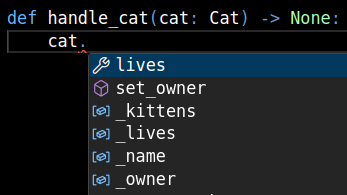
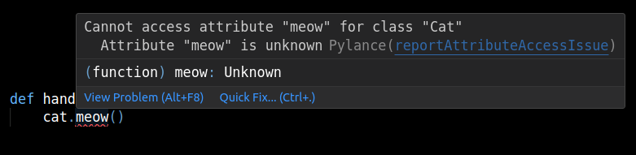
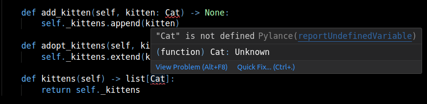
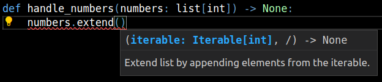

# Working with classes

The [previous chapter](../0-start-here/index.md) explained how type hints work in general, and how you can use them
to describe the contracts of your functions. This chapter is all about classes.

The basics of annotating classes are not that hard. Let's start off with an example:


=== "Without type hints"

    ```py
    class Cat:
        def __init__(self, name, lives=9):
            self._name = name
            self._lives = lives
            self._owner = None
            self._kittens = []

        @property
        def lives(self:
            return self._lives

        def set_owner(self, name):
            self._owner = name

        def __repr__(self):
            return f"<Cat {self._name!r} lives={self._lives!r} _owner={self._owner!r}>"
    ```

=== "With type hints"

    ```py
    class Cat:
        def __init__(self, name: str, lives: int = 9) -> None:
            self._name = name
            self._lives = lives
            self._owner: str | None = None
            self._kittens: list[Cat] = []

        @property
        def lives(self) -> int:
            return self._lives

        def set_owner(self, name: str) -> None:
            self._owner = name

        def __repr__(self) -> str:
            return f"<Cat {self._name!r} lives={self._lives!r} _owner={self._owner!r}>"
    ```

As you can see:

- Methods are annotated almost exactly the same as functions
- `self` is not annotated in any way
- Special methods like `__init__`, `__repr__`, `__len__` and so on
  should be fully annotated as well
- Attribute types are usually inferred from the `__init__` method, but sometimes it's not possible.
  If you have an attribute that starts off as `None` or an empty collection, you should annotate
  it explicitly.

## Editor integration example


<figure markdown="span">
    
    <figcaption>Autocompletion for attributes and method</figcaption>
</figure>


<figure markdown="span">
    
    <figcaption>Error with a missing attribute/method</figcaption>
</figure>

## Adding kittens

Let's add some methods to work with the kittens of our cat:

```py
    def add_kitten(self, kitten: Cat) -> None:
        self._kittens.append(kitten)

    def adopt_kittens(self, kittens: list[Cat]) -> None:
        self._kittens.extend(kittens)

    def kittens(self) -> list[Cat]:
        return self._kittens
```

Oh no, we got some red squiggles! And the code fails at runtime.



```
Traceback (most recent call last):
  File "/home/kitty/erp-system/main.py", line 1, in <module>
    class Cat:
  File "/home/kitty/erp-system/main.py", line 18, in Cat
    def add_kitten(self, kitten: Cat) -> None:
                                 ^^^
NameError: name 'Cat' is not defined
```

We said in the previous article that annotations have no effect at runtime.
That's not quite true. Functions (and classes) do store their annotation as metadata,
just like they store their name, default arguments and even their source code
for inspection purposes.

```
>>> def add(x: int, y: int) -> int:
...     return x + y
...
>>> add.__name__
'add'
>>> add.__annotations__
{'x': <class 'int'>, 'y': <class 'int'>, 'return': <class 'int'>}
```

This metadata doesn't perform any validation and doesn't make the function any faster.
However, libraries like [`pydantic`](https://docs.pydantic.dev/latest/) and
[`typeguard`](https://typeguard.readthedocs.io/en/stable/userguide.html) can make
use of this metadata for their own purposes.

Our annotation doesn't work because we haven't _created_ the `Cat` class yet, but we're
trying to reference it. It's like trying to run `x = x + 1` with no `x` variable defined beforehand.

This can be worked around by putting the annotation in quotes:
```py
    def add_kitten(self, kitten: "Cat") -> None:
        self._kittens.append(kitten)

    def adopt_kittens(self, kittens: "list[Cat]") -> None:
        self._kittens.extend(kittens)

    def kittens(self) -> "list[Cat]":
        return self._kittens
```
Type checkers will still understand the type hints, but they will be stored as a string in the metadata.

??? note "Alternative method"

    You may have seen this in other places:

    ```py
    from __future__ import annotations

    class Cat:
        ...

        def add_kitten(self, kitten: Cat) -> None:
            self._kittens.append(kitten)
    ```

    This is the [PEP 563](https://peps.python.org/pep-0563/) way of using "deferred annotations".
    It automatically turns all function and class annotations into quotes. It does look
    cleaner and requires less work if you're rearranging classes, however, this trick is superseded
    by [PEP 649](https://peps.python.org/pep-0649/) and will be deprecated/removed in the future.

    You can use `from __future__ import annotations` instead, but be aware that you will have to slightly
    adjust your code in future versions of Python.


## Think of the kittens

The three methods we just added may look fine, but they have a few problems that can manifest when we
try using our class.

- Adopting several kittens

    The `adopt_kittens()` method says that you need a _list_ of kittens. That's a bit too restrictive.
    If I have a tuple of kittens or an iterator of kittens, should they be left cold and hungry?
    Or should the caller do `list(tuple)` which takes extra time and memory?

    Moreover, it's legal for the function to modify the list provided in the argument.

- Getting all the kittens

    The `kittens()` method has similar problems, but in a more subtle way.

    First, it reveals our internal implementation of how we store kittens. It will be hard to
    switch to a [`deque`](https://docs.python.org/3/library/collections.html#collections.deque)
    in the future.

    Secondly, if someone obtains our list of kittens, the type hints are telling them they can treat it
    as any old list. This can be devastating:
    ```py
    def handle_cat(cat: Cat) -> None:
        cat.kittens().clear()  # no complaints from our type checker
    ```

### `Iterable`

Let's see how the `extend()` method of `list` objects handles the first problem. After all, it works with
`list`s, `tuple`s, `range`s and other things.



`list.extend` works with any [_iterable_](https://docs.python.org/3/glossary.html#term-iterable) object. An
_iterable_ is something you can put in a `for` loop to go over ("iterate over") its items. `Iterable` and
similar items like `Sequence`, `Iterator`, `Mapping` are available in the standard
[`collections.abc`](https://docs.python.org/3/library/collections.abc.html#collections-abstract-base-classes)
module. Let's see it in action:

```py
from collections.abc import Iterable

def handle_numbers(numbers: Iterable[int]) -> None:
    numbers.append(42)  # error: `Iterable[int]` has no method `append`

    for n in numbers:   # ok, `n` is an `int`
        print(n + 1)    # ok
        print(n + "!")  # error: can't add a string to an integer

handle_numbers([1, 2, 3])  # ok
handle_numbers((1, 2, 3))  # ok
handle_numbers(range(69))  # ok
```

Let's modify our `adopt_kittens` method:

```py
from collections.abc import Iterable

class Cat:
    ...

    def adopt_kittens(self, kittens: "Iterable[Cat]") -> None:
        self._kittens.extend(kittens)
```

### Siblings of `Iterable`

Here are some other items from `collections.abc` you'll find useful:

| Item | Description |
| :--------- | ----------- |
| `Iterator[T]` | Something you can call `next()` on. See [_iterator_](https://docs.python.org/3/glossary.html#term-iterator) |
| `Mapping[K, V]`  | An object supporting `mapping[key]` syntax and other read-only dict-like operations (like `mapping.items()`). See [_mapping_](https://docs.python.org/3/glossary.html#term-mapping) |
| `Sequence[T]` | An object supporting iteration, indexing, `len()` and `in`. `list`, `tuple` and `range` are sequence |
| `MutableSequence[T]` | Like `Sequence`, but also supports mutation with `obj[index] = value`, `clear()`, `append()` etc. |
| `Collection[T]` | An object supporting iteration, `len()` and `in`. `set` is a collection but not a sequence |
| `Callable` | Something you can `call()`. We will discuss it in a later chapter |


To solve the current problems with `kittens()`, let's use `Collection` instead of list:

```py
from collections.abc import Collection


class Cat:
    ...

    def kittens(self) -> "Collection[Cat]":
        return self._kittens
```


## Data classes

Classes are commonly used to bundle related pieces of information:

```py
class Dog:
    def __init__(self, age: int, name: str, height: float, length: float) -> None:
        self.age = age
        self.name = name
        self.height = height
        self.length = length

    def cross_section(self) -> float:
        return self.height * self.length

    def __eq__(self, other: object) -> bool:
        if not isinstance(other, Dog):
            return NotImplemented
        return (
            (self.age, self.name, self.height, self.length)
            == (other.age, other.name, other.length, other.height)
        )

    def __repr__(self) -> str:
        return (
            "Dog("
            f"age={self.age!r}"
            f", name={self.name!r}"
            f", height={self.height!r}"
            f", self.lenght={self.length!r}"
            ")"
        )
```

This is rather verbose, repetitive, and error-prone. It could be much easier to read and write.
The standard library has a [`dataclasses`](https://docs.python.org/3/library/dataclasses.html) module:

```py
from dataclasses import dataclass

@dataclass
class Dog:
    age: int
    name: str
    height: float
    length: float

    def cross_section(self) -> float:
        return self.height * self.length
```

This does exactly the same as the previous snippet (Except for the typos. Did you spot them?).

```
>>> dog = Dog(age=1, name="fido", height=100.0, length=60.0)
>>> dog
Dog(age=1, name='fido', height=100.0, length=60.0)
>>> dog.name
'fido'
>>> dog.name = 'treat enjoyer'
>>> dog
Dog(age=1, name='treat enjoyer', height=100.0, length=60.0)
>>> dog.cross_section()
6000.0
```

`@dataclass` has several flags. We recommend using these in most cases:

- `kw_only` prevents you from calling the class with positional arguments, like
    ```py
    Dog(1, "fido", 100.0, 60.0)
    ```
    It's not immediately clear what `1`, `100.0` and `60.0` are, so keyword-only arguments make sense here.
- `frozen` prevents you from mutating the object after creation.

```py
@dataclass(kw_only=True, frozen=True)
class Dog:
    age: int
    name: str
    height: float
    length: float

    def cross_section(self) -> float:
        return self.height * self.length
```
