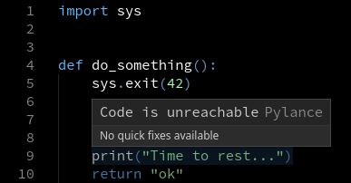
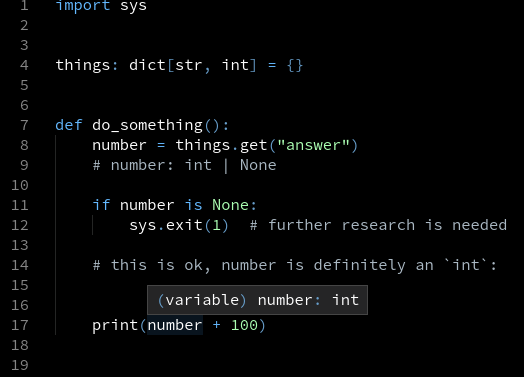

# `NoReturn` doesn't just mean no `return` statement

Is this the right annotation for `greet`?

```py
from typing import NoReturn


def greet(name: str) -> NoReturn:
    print("Hello, {0}!".format(name))
```

This sounds right: after all, the function doesn't have a `return` statement. However, `NoReturn` means a very specific thing.

A function `f` returns `NoReturn` if, in the following configuration, `g()` never runs:
```py
f()
g()  # unreachable
```

It means that either:

- `f` always runs an infinite loop
- `f` always raises an exception
- `f` always terminates the current process.


## What even is the point?

With `NoReturn`, static analyzers can adjust their control flow model.
For example, if you call `sys.exit`, Pylance knows that the next lines will never execute:



This also affects type narrowing.




## Correct usage examples

```py
# Always raises an exception
def report_syntax_error(node: TreeNode, message: str) -> NoReturn:
    template = "Invalid syntax at line {0}, column {1}: {2}"
    raise SyntaxError(template.format(node.line, node.col, message))
```

```py
# Runs forever (or raises an exception)
async def process_events(stream: EventStream) -> NoReturn:
    while True:
        event = await stream.fetch()
        await process_event(event)
```
