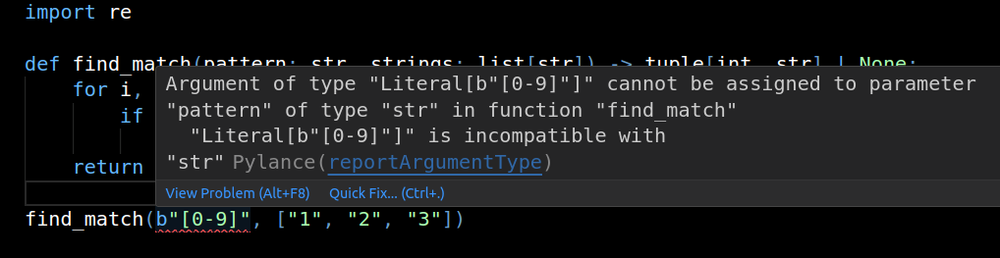
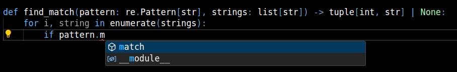
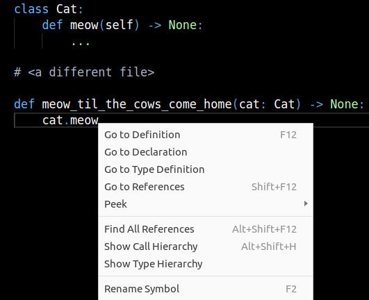
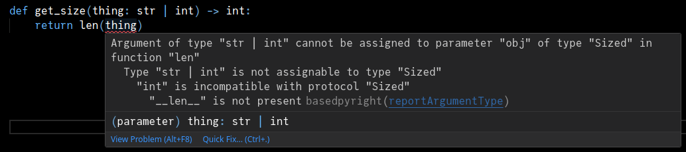
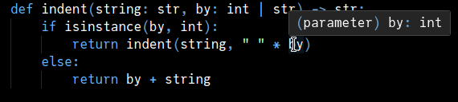

# Introduction

This article explains the basics of type hints.
If you know how to write Python functions, you should be well equipped to read this.

## What are type hints?

Type hints are optional annotations that you can put on your functions and classes
to suggest what kinds of values they're intended to deal with. For example:

```py
# without type hints

def add_squares(x, y):
    return x**2 + y**2

def find_match(pattern, strings):
    for i, string in enumerate(strings):
        if re.match(pattern, string) is not None:
            return i, string
    return None


# with type hints

def add_squares(x: int, y: int) -> int:
    return x**2 + y**2

def find_match(pattern: str, strings: list[str]) -> tuple[int, str] | None:
    for i, string in enumerate(strings):
        if re.match(pattern, string) is not None:
            return i, string
    return None
```

What's the purpose of adding type hints to functions?


### Error checking

**Type hints don't do anything at runtime.** They do not insert `isinstance` checks to ensure
that the arguments are of the expected types. As you'll see later, it's not possible in the general case.

If you call `find_match` with two integers, you will get the same runtime behavior with or without
type hints.

However, you can run an external tool, called a "type checker", that can find such mistakes
_without running the code_:

<figure markdown="span">
    
    <figcaption>Running `Pylance` in VSCode</figcaption>
</figure>

Here's an example of running `mypy` on the following function:
```py
def find_phone(fields: list[str]) -> str:
    _i, phone = find_match("^[-+0-9()]{1,15}$",  fields)
    return phone
```

```
$ python -m mypy main.py
main.py:13: error: "None" object is not iterable  [misc]
Found 1 error in 1 file (checked 1 source file)
```


### Editor support

Type hints allow you to write and read code more effectively in your editor.

<figure markdown="span">
    
    <figcaption>Autocompletion for a method in VSCode</figcaption>
</figure>

<figure markdown="span">
    
    <figcaption>Navigating your codebase in VSCode</figcaption>
</figure>

If you have this untyped function:

```py
def frobnicate(thing):
    thing.foo()

    if thing.is_active:
        thing.bar()
```

You might have a guess as to what `thing` is, but your editor doesn't. If you annotate `thing`
with the class that you're expecting, you can now go to the source code of `Thing.foo` and `Thing.bar`,
or rename `bar` to `baz` in the entire codebase.


### Deriving behavior from annotations

You can inspect the type annotations of a function or class:

```python-repl
>>> import annotationlib
>>> def foo(bar: int, baz: str = "hello", mystery=None) -> list[bool]:
...     return [2 + 2 == 5]
...
>>> annotationlib.get_annotations(foo)
{'bar': <class 'int'>, 'baz': <class 'str'>, 'return': list[bool]}
>>>
```

Libraries can use this metadata to derive some interesting behavior. For example,
[`cattrs`](https://catt.rs/en/stable/) uses class annotations to convert "untyped"
data that you get from e.g. parsing JSON or YAML into a tree of typed objects, validating
that the types are as you expect.


### Documentation

Type hints serve as _formal documentation_: it's a standardized way to explain to other developers
how to call this function. As always, "other developers" includes you two weeks later.

Developers can be reluctant to add useful inline documentation, especially when everything seems self-evident
when they're writing the code. If you can convince your team to use type annotations everywhere, you get useful
machine-checked documentation even from hardened comment haters.


## How to get started

### Configure your editor

=== "VSCode"

    Install the ["basedpyright" extension](https://marketplace.visualstudio.com/items?itemName=detachhead.basedpyright).
    If you previously installed the "Python" extension or the "Pylance" extension, you'll need to disable or uninstall
    Pylance (but keep the Python extension!).

    basedpyright starts off with a pretty strict configuration. If you are overwhelmed by the red squiggles,
    you can go to Setting (`Ctrl+,`) -> `basedpyright` -> change "Type checking mode" to "standard".
    We will revisit configuration and error messages later (TODO).

=== "PyCharm"

    No need to configure anything, you should be good to go.

    If you don't like PyCharm's built in type annotation analysis (which is known for being quirky at times),
    you can use [basedpyright in PyCharm](https://docs.basedpyright.com/v1.21.0/installation/ides/#pycharm).

=== "vim, emacs, helix, sublime text"

    If your editor supports the Language Server Protocol, you can use `basedpyright` with it.

    1. Look for instructions for your editor at:
       [https://docs.basedpyright.com/latest/installation/ides/](https://docs.basedpyright.com/latest/installation/ides/)
    2. ...or search for "[your editor] basedpyright" in your favorite search engine

=== "command line"

    You can run `mypy`, `pyright` or `basedpyright` on the command line:

    - [mypy instructions](https://mypy.readthedocs.io/en/stable/getting_started.html)
    - [pyright instructions](https://microsoft.github.io/pyright/#/installation?id=command-line)
    - [basedpyright instructions](https://docs.basedpyright.com/latest/installation/command-line-and-language-server/)


??? note "Why so many tools?"

    > There should be one-- and preferably only one --obvious way to do it

    Well, that didn't work out. There are now several tools for type checking Python code: `mypy`, `pyanalyze`,
    `pytype`, `pyre`, `pyright`, `pylance`, `basedmypy`, `basedpyright`, `zuban`, Pycharm's analyzer thing,
    and the "alpha" `ty` and `pyrefly` programs. They all roughly follow the
    [typing specification](<https://typing.python.org/en/latest/>) and the typing-related PEPs, similarly to
    how C and C++ compilers relate to the C and C++ specifications, or how browsers relate to universal web standards.

    mypy is the original type checker that existed even before "type hints" were adopted into the language.
    I personally prefer `pyright` over `mypy` because it has better (IMO) inference rules and provides
    editor integration. However, your mileage may vary. If your company is using `mypy` on all their projects, stick with
    `mypy`.

    More on the differences between pyright and mypy:
    [https://microsoft.github.io/pyright/#/mypy-comparison](https://microsoft.github.io/pyright/#/mypy-comparison)

    `basedpyright` is a fork of `pyright`. It ports some features from Pylance (a closed-source Microsoft product),
    adds a few extra diagnostics and various quality of life improvements. It also provides an official PyPI package
    ([based]pyright is written in _TypeScript_, not Python, which presents a little bit of friction if you want to
    use it as a Python developer).

    There are two up and coming type checkers/language servers, [Ty](https://docs.astral.sh/ty/) and
    [Pyrefly](https://pyrefly.org/). With luck, one of them is going to take over the zoo of existing tooling just like
    `ruff` took over linting and formatting.

    For the purposes of this tutorial, I recommend `basedpyright` because it is stable and provides a good editor
    experience.
    But if you prefer Python tooling that's made in Python or have other objections, feel free to use
    `mypy` &mdash; it shouldn't interfere with this tutorial.


!!! note "I don't want to install anything"

    You can play around with types at the [Basedpyright playground](https://basedpyright.com/)

### Run a basic example

In your editor, create a new Python file with the following contents;

```py
def add_squares(x: int, y: int) -> int:
    return x**2 + y**2

print(add_squares(10, 20))
print(add_squares("42", "hmm"))
```

You should see a warning to the effect of "`x` is supposed to be an `int`, but you provided a string"

When you run this program, you should see that the first `print` executed and printed `500`, but the
second call to `add_squares` failed with an exception:

```
TypeError: unsupported operand type(s) for ** or pow(): 'str' and 'int
```

### Remember, no effect at runtime

Try a different example:

```py
def double(number: int) -> int:
    return number + number

print(double("42"))
```

You should see a similar warning from your type checker. However, if you execute this code,
Python doesn't complain and simply prints `4242`.

## Different kinds of types

The term "type" in Python usually means the same as "class". But when talking about type hints,
"type" is a more general term for describing a set of allowed values. In the initial example at
the top of the page you've seen `list[X]` which specifies what elements the list holds,
and `X | None` to denote when a value can be `None`.

So in this tutorial, "type" always means something you can stick in an annotation, and "class"
always means "class", the result of calling `type()` on something at runtime.

Let's discuss the most common types you'll use in type hints.

### Classes

A class is the simplest type hint you can have. You've already seen it in action in this tutorial.

```py
class Dog:
    ...

def create_dog(height: int) -> Dog:
    dog = Dog()
    dog.grow(height)
    return dog
```

Every Python object is an instance of the `object` class, so if you want to accept any value
in your function, you can use `object` as the type hint:

```py
def print_twice(thing: object) -> None:
    print(thing)
    print(thing)
```

### Union

Sometimes you want to accept or return either one type or a different type. This is expressed with
the pipe operator (`|`):

```py
def indent(string: str, by: int | str) -> str:
    if isinstance(by, int):
        return indent(string, " " * by)
    else:
        return by + string
```

The first argument is a string, and the second argument is either an integer or a string.

If you have a value of a union type, you are only allowed to do operations on it that would be valid
for all of the options. You have to handle all the possibilities.



This is fine though, because `print` works with both `int` and `str`:
```py
def display(thing: str | int) -> None:
    print(thing)
```

As you can guess from the `indent` function, type checkers understand some forms of flow control.
Inside the "then" block of the `if`, a type checker considers the `by` variable to be of type `int`.



This is called _type narrowing_. Narrowing isn't standardized and differs between type checkers.
You can find details for narrowing in Pyright on this page:
[https://microsoft.github.io/pyright/#/type-concepts-advanced?id=type-narrowing](
https://microsoft.github.io/pyright/#/type-concepts-advanced?id=type-narrowing
)


### None

The `None` object is special. You don't need to specify the class of `None`, instead you just write `None`.

```py
def maybe_print(item: str | None = None) -> None:
    if item is not None:
        print(item)
```

!!! note "Defaults"
    Note that the default value for an argument is written after the annotation.

It's often used in combination with `|`, because accepting "something or `None`" is very common.

!!! note "`-> None`"

    Remember, if a function doesn't execute a `return` statement, it returns `None`. In that case
    you should annotate it with `-> None`.
    ```py
    def my_print() -> None:
    ```
    omitting `-> None` doesn't mean the same thing, it means that you forgot to specify the return type.


### Types with parameters

Collections such as `list`, `dict`, `set` require parameters when you use them in type hints.

```py
def is_nice(numbers: set[int]) -> bool:
    return 69 in numbers or 420 in numbers

# dict needs two parameters, separated with a comma
def count(strings: list[str]) -> dict[str, int]:
    counter: dict[str, int] = {}
    for key in strings:
        counter[key] = counter.get(key, 0) + 1
    return counter
```

!!! note "Empty collections"
    Whenever you have an empty collection assigned to a variable, you need to give it an annotation:
    ```py
    names: list[str] = []
    ```
    If you just do `names = []`, the type checker will have no idea whether this list is supposed to
    contain strings, numbers, dogs, or a combination of those.

    This is a "variable annotation" as opposed to a parameter annotation or return type annotation.


### If you just don't care

If your type checker refuses to cooperate, you can use `typing.Any`.
`Any` lets you do absolutely anything with an object.

```py
from typing import Any

def resurrect(being: Any) -> None:
    being += 1
    being.quack()
    for cell in being:
        cell.meow()
```
For example, `json.loads()` and `pickle.loads()` both return `Any`.

This is handy, but don't overuse `Any`. By design, `Any` will prevent type checkers from finding issues.

If you want to use `Any`, read these first:

- [Avoid `Any`](../../one-offs/avoid-any/index.md)
- [Is `object` the same as `Any`](../../one-offs/object-vs-any/index.md)

In particular, see if you can use `object` (the base class of all other classes) instead of `Any`.
It allows the same set of objects as `Any` but doesn't remove static analysis:

```py
def print_both(x: object, y: object) -> None:
    print(x)  # ok
    print(y)  # ok
    print(x + "!")  # type checking error
```


## Type inference

Great, now you know how to annotate function parameters. But what about all the stuff that happens
inside a function?

If a value is not explicitly annotated, a type checker will _infer_ its type. It will look around
that value and try to deduce what its type is. For example:

```py
def count_f(string: str) -> int:
    small = string.count("f")
    big = string.count("F")
    return small + big
```

Type checkers know that `str` has a `count` method expecting a string
and returning an integer. Given that, it deduces that `small` and `big` are
`int`s.

You can see what type your type checker infers for a variable by hovering over it:


If you're running a type checker over the command line, you can use `typing.reveal_type`:

```
$ cat test.py
from typing import reveal_type

def count_f(string: str) -> int:
    small = string.count("f")
    big = string.count("F")
    reveal_type(big)
    return small + big

$ basedpyright test.py
/tmp/test.py
  /tmp/test.py:6:17 - information: Type of "big" is "int"
0 errors, 0 warnings, 1 note

```

This is why you shouldn't annotate most of your variables: the type checker will
already know what type it is.

## But wait, there's more

What you've learned so far is more than enough to get started. Try using type hints in your next project.
However, there's much more to type hints, and you might need more advanced things in the future.

- Read more articles on this website :slight_smile:
- [typing documentation](https://typing.readthedocs.io/en/latest/)
- [mypy cheat sheet](https://mypy.readthedocs.io/en/stable/cheat_sheet_py3.html)
- The `#type-hinting` channel in [Python Discord](https://discord.gg/python)