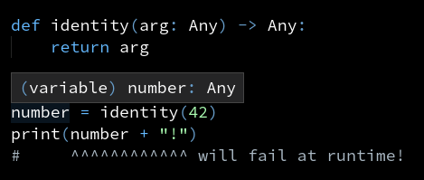
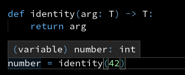
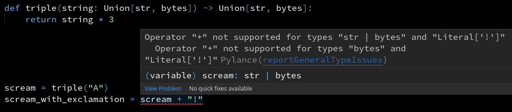
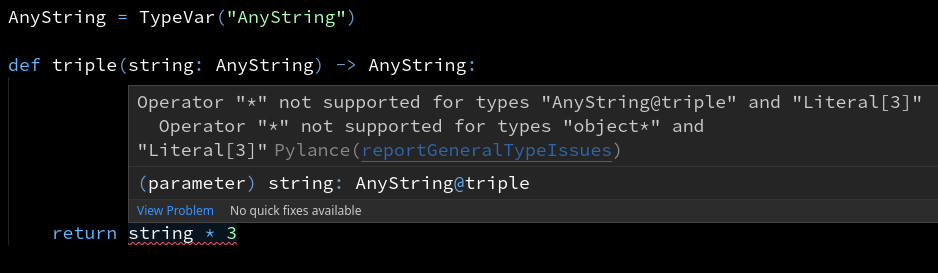

# Type variables

This is a short introduction to type variables, or `TypeVar`s.


## The problem

This function accepts anything as the argument and returns it as is.
How do you explain to the type checker that the return type is the same as the type of `arg`?

```py
def identity(arg):
    return arg
```

### Why not use `Any`?
```py
def identity(arg: Any) -> Any:
    return arg
```
If you use `Any`, the type checker will not understand how this function works:
as far as it's concerned, the function can return anything at all.
The return type doesn't depend on the type of `arg`.

We'd really want `number` to be an `int` here, so that the type checker will catch an error on the next line:



### Why not specialize the function for different types?

```py
def identity_int(arg: int) -> int:
    return arg

def identity_int(arg: str) -> str:
    return arg

def identity_list_str(arg: list[str]) -> list[str]:
    return arg

...
```

1. This doesn't scale well. Are you going to replicate the same function 10 times? Will you remember to keep them in sync?

2. There are infinitely many types! Not just combinations of standard types, but also user-defined classes and classes from other libraries.

## The solution: type variables

_Type variables_ allow you to link several types together.
This is how you can use a type variable to annotate the `identity` function:

```py
from typing import TypeVar

T = TypeVar("T")

def identity(arg: T) -> T:
    return arg
```

Here the return type is "linked" to the parameter type:
whatever you put into the function, the same thing comes out.

This is how it looks in action:




## Putting constraints on a type variable

Is this a well-typed function?

```py
def triple(string: Union[str, bytes]) -> Union[str, bytes]:
    return string * 3
```

If you pass in a string, you always get a string, same with bytes.
But the type doesn't say quite that: whether you pass in a `str` or a `bytes` object, you will
get `Union[str, bytes]` back.




"If you pass in `str`, you get `str`. If you pass in `bytes`, you get `bytes`"
&mdash; sounds like a job for a type variable. Right?



The error is fair enough. `AnyString` doesn't have to be a string or a bytestring,
it could be a list or a `pathlib.Path` or even a function.
Therefore we're not allowed to multiply `string`.

We can put a _bound_ on our type variable: it should only accept `str` or `bytes`.

```py
from typing import Union

AnyString = TypeVar("AnyString", bound=Union[str, bytes])

def triple(string: AnyString) -> AnyString:
    return string * 3

unicode_scream = triple("A") + "!"
bytes_scream = triple(b"A") + b"!"
```

Here we've achieved two goals:

- ensuring that the input is either a `str` or a `bytes` object
- linking the argument type to the return type

## Using type variables as parameters

You can also use type variables as parameters to generic types, like `list` or `Iterable`.

```py
from collections.abc import Iterable, Iterator
from typing import TypeVar


T = TypeVar("T")


def remove_falsy_from_list(items: list[T]) -> list[T]:
    return [item for item in items if item]


def remove_falsy(items: Iterable[T]) -> Iterator[T]:
    for item in items:
        if item:
            yield item
```


However, this gets tricky pretty fast. We'll cover it in depth in a different article.


## Links

- `mypy` documentation on generic functions: [mypy documentation](https://mypy.readthedocs.io/en/stable/generics.html#generic-functions)
