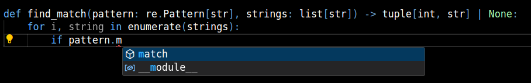
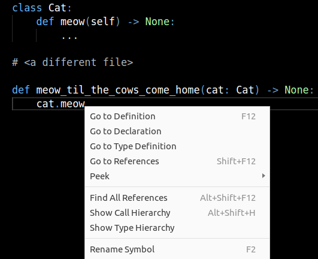

# From Zero to Types

This article explains all you need to know about type hints (for now).
If you know how to write Python functions, you should be well equipped to read this.

## What are type hints?

Type hints are optional annotations that you can put on your functions and classes
to suggest what kinds of values they're intended to deal with. For example:

```py
# without type hints
def find_match(pattern, strings):
    for i, string in enumerate(strings):
        if re.match(pattern, string) is not None:
            return i, string
    return None

# with type hints
def find_match(pattern: str, strings: list[str]) -> tuple[int, str] | None:
    for i, string in enumerate(strings):
        if re.match(pattern, string) is not None:
            return i, string
    return None
```

This reads as:

- the `pattern` argument should be a string
- the `strings` argument should be a list, where each element is a string
- the function returns either an `(integer, string)` tuple or `None`

Why would anyone do that?

### Documentation

Type hints serve as _formal documentation_: it's a standardized way to explain to other developers
how to call this function. "Other developers" includes _you_ two weeks later :slight_smile:

### Error checking

Type hints don't _do_ anything at runtime: you're free to call `find_match(42, socket.socket())`
and get a nasty error like `TypeError: 'socket' object is not iterable`.

However, you can run an external tool (called a "type checker") that can find such mistakes
_without running the code_:

<figure markdown="span">
    
    <figcaption>Running `Pylance` in VSCode</figcaption>
</figure>

This can seem trivial: this function clearly works with strings, why would you call it
with `bytes`? Or a socket?! And this should be caught with the most basic unit test.

- Without the type hints, you'd have to examine the implementation of this function to
  know what argument types it expects. In a real codebase, you might have to dig through
  several layers of calls to figure out the interface of a function.

- It's not always easy to see that you're not using a function correctly. For example, you
    might forget that `find_match` returns `None` when a match isn't found and write code like this:

    ```py
    def find_phone(fields: list[str]) -> str:
        _i, phone = find_match("^[-+0-9()]{1,15}$",  fields)
        return phone
    ```
    A type checker will remind you that `find_match` can return `None`, which you won't be able to
    unpack like this.

### Editor support

Type hints allow you to write and read code more effectively in your editor.

<figure markdown="span">
    
    <figcaption>Autocompletion for a method in VSCode</figcaption>
</figure>

<figure markdown="span">
    
    <figcaption>Navigating your codebase in VSCode</figcaption>
</figure>

## How to get started

### Configure your editor

=== "VSCode"

    Install the ["basedpyright" extension](https://marketplace.visualstudio.com/items?itemName=detachhead.basedpyright). If you previously installed the "Python" extension or the "Pylance" extension, you'll need to disable or uninstall Pylance.

    You can also use Pylance. It does the same thing, but:

    - it's closed-source
    - because it's closed-source, it's not available in VSCodium (which I recommend as well!)
    - if you are serious about type hints, you'll need to go to "settings", find "pylance > type checking mode" and
        switch it from "off" to "standard". Otherwise, it won't complain about errors, even basic ones like `foo: str = 42`

=== "PyCharm"

    No need to install anything, you should be good to go.

=== "vim, emacs, sublime text"

    If your editor supports the Language Server Protocol, you can use `basedpyright` with it.
    Search for "[your editor] basedpyright" in your favorite search engine and you'll find the right instructions

=== "command line"

    You can run `mypy` or `pyright` on the command line:

    - [mypy instructions](https://mypy.readthedocs.io/en/stable/getting_started.html)
    - [pyright instructions](https://microsoft.github.io/pyright/#/installation?id=command-line)

    If you are feeling adventurous, you can use one of the "based" forks of the above:

    - [basedmypy instructions](https://kotlinisland.github.io/basedmypy/getting_started.html#installing-and-running-basedmypy)
    - [basedpyright instructions](https://docs.basedpyright.com/latest/installation/command-line-and-language-server/)

    I like `pyright`/`basedpyright` better, but `mypy` is older and more popular.

!!! note "I don't want to install anything"

    You can play around with types at the [Basedpyright playground](https://basedpyright.com/)

### Run a basic example

```py
def add_squares(x: int, y: int) -> int:
    return x**2 + y**2

print(add_squares(10, 20))
print(add_squares("42", "hmm"))
```

You should see a warning to the effect of "`x` is supposed to be an `int`, but you provided a string"

### Remember, no effect at runtime

Try a different example:

```py
def double(number: int) -> int:
    return number + number

print(double("42"))
```

You should see a similar warning from your type checker. However, if you execute this code,
Python doesn't complain and simply prints `4242`.

## Different kinds of types

Let's go over different things that you can annotate your functions with. In Python, a "type" is often
synonymous with a "class" (see `type([1, 2, 3])` for example). However, type hints can be more detailed.
For example, `list` on its own is not very useful: what's in the list? But you can use `list[int]` to
denote that every element of the list is an `int`.

### Classes

A class is the simplest annotation you can have. You've already seen it in action in this tutorial.

```py
class Dog:
    ...

def create_dog(height: int) -> Dog:
    dog = Dog()
    dog.grow(height)
    return dog
```

### Union

Sometimes you want to accept or return either one class or a different class. This can be done with
the pipe `|` operator.

```py
def indent(string: str, by: int | str) -> str:
    if isinstance(by, int):
        return indent(string, " " * by)
    else:
        return by + string
```

The first argument is a string, and the second argument is either an integer or a string.

### None

The `None` object is special. You don't need to specify the class of `None`, instead you just write `None`.

```py
def maybe_print(item: str | None = None) -> None:
    if item is not None:
        print(item)
```

!!! note "Defaults"
    Note that the default value for an argument is written after the annotation.

It's often used in combination with `|`, because accepting "something or `None`" is very common.

!!! note "`-> None`"

    Remember, if a function doesn't execute a `return` statement, it returns `None`. In that case
    you should annotate it with `-> None`.
    ```py
    def my_print() -> None:
    ```
    omitting `-> None` doesn't mean the same thing, it means that you forgot to specify the return type.

### Types with parameters

Collections such as `list`, `dict`, `set` require parameters when you use them in type hints.

```py
def is_nice(numbers: set[int]) -> bool:
    return 69 in numbers or 420 in numbers

# dict needs two parameters, separated with a comma
def count(strings: list[str]) -> dict[str, int]:
    counter: dict[str, int] = {}
    for key in strings:
        counter[key] = counter.get(key, 0) + 1
    return counter
```

!!! note "Empty collections"
    Whenever you have an empty collection assigned to a variable, you need to give it an annotation:
    ```py
    names: list[str] = []
    ```
    If you just do `names = []`, the type checker will have no idea whether this list is supposed to
    contain strings, numbers, dogs, or a combination of those.

    This is a "variable annotation" as opposed to a parameter annotation or return type annotation.

### If you just don't care

If your type checker refuses to cooperate, you can use `typing.Any`.
`Any` lets you do absolutely anything with an object.

```py
from typing import Any

def resurrect(being: Any) -> None:
    being += 1
    being.quack()
    for cell in being:
        cell.meow()
```
For example, `json.loads()` and `pickle.loads()` both return `Any`.

This is handy, but don't overuse `Any`. By design, `Any` will prevent type checkers from
detecting all the "wrong stuff" you will do with the value.
<!-- ^perhaps this should be better worded -->

If you want to use `Any`, read these first:

- [Avoid `Any`](../../../one-offs/avoid-any/index.md)
- [Is `object` the same as `Any`](../../../one-offs/object-vs-any/index.md)


## Type inference

Great, now you know how to annotate function parameters. But what about all the stuff that happens
inside a function?

If a value is not explicitly annotated, a type checker will _infer_ its type. It will look around
that value and try to deduce what its type is. For example:

```py
def count_f(string: str) -> int:
    small = string.count("f")
    big = string.count("F")
    return small + big
```

Type checkers know that `str` has a `count` method expecting a string
and returning an integer. Given that, it deduces that `small` and `big` are
`int`s.

You can see what type your type checker infers for a variable by hovering over it:


This is why you shouldn't annotate most of your variables: the type checker will
already know what type it is.

## But wait, there's more

What you've learned so far is more than enough to get started. Try using type hints in your next project.
However, there's much more to type hints, and you might need more advanced things in the future.

- Read more articles on this website :slight_smile:
- [typing documentation](https://typing.readthedocs.io/en/latest/)
- [mypy cheat sheet](https://mypy.readthedocs.io/en/stable/cheat_sheet_py3.html)
- The `#type-hinting` channel in [Python Discord](https://discord.gg/python)